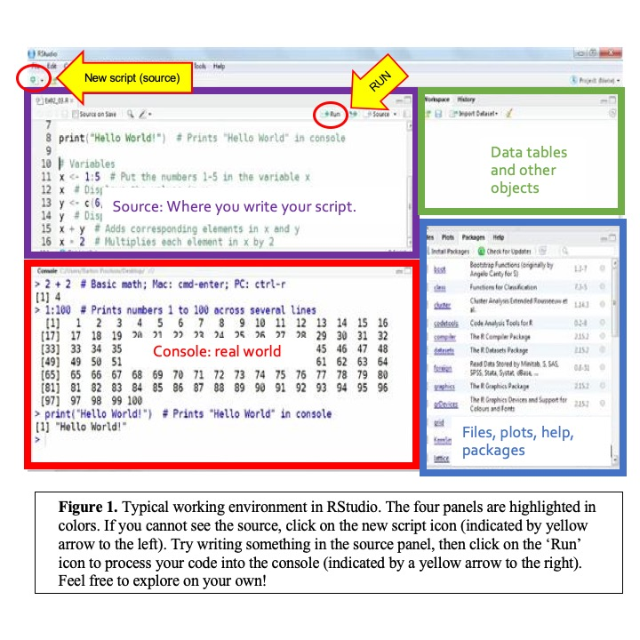

# Day 2, morning, using programs in Bash

> Add the flag to the corner of your screen 

To start this tutorial you need to be logged in the Linux virtual machine
[vlinux.humboldt.edu](https://vlinux.humboldt.edu/)

Once logged in the Linux machine, look for the Terminal, it is an icon that contains the characters '>\_'

You can also write 'terminal' in the search bar of the main manu located in the left bottom of the operating system.

## Using programs

The terminal is a powerful to run programs, as you can analyze tons of data with only a single command. In this tutorial we will run several aplpications in the terminal and will learn the principles of automatizing data processing.

### Downloading data and initial screening of files

Before analysing the quality of the sequences we need to undertand the basics of [next-generation-sequencing](https://www.youtube.com/watch?v=fCd6B5HRaZ8)

We will use FastQC quatify measure the quality of data in a file.
Please download in your machine a compressed file with the data in a folder named `day_1`:

```
cd Documents
mkdir day_1
cd day_1
wget https://github.com/oscarvargash/cirm_26/raw/main/day_1/files/files.zip
```

As you can see, this is a compressed file. We can decompressed by

```
unzip files.zip
ls
```

We can remove now the `.zip` file. How can we remove this files from our folder?

<details>
  <summary>Click to see an answer!</summary>
  
```
rm *.zip
```

</details>


We can try to get peek in the in the file to see what it is about. Print to the screen the first ten lines of the file by typing using the command `head`:

```
head L008_R1.fastq
```


### Using FastQC

We can use FastQC to evaluate the quality of the file. We can check that fastqc is installed in our machine by typing:

```
which fastqc
```

You can use the same command with native programs like `grep` and `cat`. Notice that all programs are placed in `/usr/bin/`. In our case the executable file with the program has been added to this folder as weell.


First let's figure out how does FastQC works. Most programs have a help menu. Notice that with non-native programs we can't use `man` (manual). Instead it we will type:

```
fastqc -help
``` 

It seems that we can simply add the name of the file as as the first argument, and we then add `-o` (output) to specify where the program should write the report

```
fastqc L008_R1.fastq -o .
``` 

Once it has finish you can list all files and see the output. 

```
ls
```

Open the file in firefox using the the right clik option "open with". Scroll through the results, for the purposes of this lab we will only pay attention to the "basic statistics" and the "per base sequence quality."  

Congrats!!! you have executed a program succesfully

### Exercise

Analyze the remaining files with FastQC. Upon completion of the analysis compare the results (basic statistics and per base sequence quality) and decide which of the files contains better data in terms of quality. Submit your answer in CANVAS along with a brief explanation.

> Remove your flag if you are good to continue 


# Day 2, late morning, basic use of R

Based on a document created by: Jason Pienaar and Tom Miller
Edited by: CCG and OMV 2022

## Outline

### Learning objectives:
* Interacting with RStudio
* Recognizing different elements in R and their functionality
* Load  data in R from external tools

What you should have at the end of this tutorial
* A script document with the code you produced in this tutorial.
* A basic understanding of how to run basic R code and obtain results.

### Content:
Introduction
Accessing R
Tips for coding
What does it look like and what does it mean?
Simplest tricks in R
R functions
Importing files

## Introduction

Why R?
R is an independent, open source statistical computing environment, incorporating implementations of an older commercial program called “S” by an international team of statisticians. Most other statistics packages are principally orientated towards applying standard methods of data analysis, which is great, but it is difficult to apply non-standard methods or to add to the capabilities of existing methods. This is primarily due to their limited programming capabilities. In addition, they are pretty expensive and require new licensing agreements etc. One of the great strengths of R (other than that it is free) is the relative ease with which new capabilities can be added (the R language is really easy to use). Thus, the user can easily create new functions or combine existing functions or data BUT in order to use R we need to learn the R language hence the simple tutorials.
 
The truth about R:
1- There is nothing more frustrating than when your code does not work
2- There is nothing more satisfying than when your code does work!

Anything worth doing, from losing weight to getting a degree, takes time. Learning R is no different. Especially if this is your first experience programming, you are going to experience a lot of headaches when you get started. You will run into error after error and pound your fists against the table screaming: “WHY ISN’T MY CODE WORKING?!?!? There must be something wrong with this stupid software!!!” You will spend hours trying to find a bug in your code, only to find that - frustratingly enough, you had had an extra space or missed a comma somewhere. You’ll then wonder why you ever decided to learn R when (::sigh::) Excel was so “nice and easy.”

## Accessing R 

### on Cal Poly Humboldt labs:
Although you can download in your personal computer (and you are encouraged to do so – find instructions on Canvas), we will work on a standardized set up on the school lab. 

> Add the flag to the corner of your screen 

* We can open Rstudio by simply typing `Rstudio` in the search bar of the OS.
 
### Obtaining your own copy of R
Both PC and Macintosh versions of R can be downloaded from the [R home page] (http://www.r-project.org/)
 
## Before you start 

### Best practices

### Tips to learn to code
* PRACTICE! A good practice consists on writing code. Do not copy and paste, do not assume that you got it by reading the tutorial: type it yourself.
* A better practice is to make sure you understand what each line of code is doing. Use # to annotate your code (see below to find out what I mean).
* Keep a notebook with these explanations: ‘File_tutorial2.R line 102: this function sums all the numbers in a vector’. 

### Some R resources
[Useful R Reference Cheatsheet by Tom Short](https://cran.r-project.org/doc/contrib/Short-refcard.pdf)
[Basic skills by Quick R](https://www.statmethods.net)
[Advanced skills Cheatsheet by Arianne Colton and Sean Chen](https://rstudio.com/wp-content/uploads/2016/02/advancedR.pdf)
[Other resources from YaRrr! The pirate’s guide to R](https://bookdown.org/ndphillips/YaRrr/r-resources.html)

## What does it look like and what does it all mean
 
 
Figure 1 is a typical workspace in Rstudio, with four panels. You may have to open a new script (source) when you open the program for the first time: click on the new script icon to the top-left corner (see Fig 1, indicated with a yellow arrow)The most important panels right now are on the left, the source and the console. The source code in the top-left corner is where you will type your code and save your script. The console is where the code runs. You can write code directly to the console to find whether it works or not, or the answer to a calculation. You can also send your code from the source to the console to run. Importantly, you will be saving your source code, if you are typing in the console, you will be unable to save your progress or reuse your code. Therefore, I recommend you ALWAYS type and work on the source panel and send your code to run and see the output on the console. The panels on the right will display your data tables, plots, help and other features, but we will get to those later.
 
## The Simplest Commands with R:

### Basic arithmetic
Open the R program by double clicking on the R icon. Under the opening message, you will find the “>” prompt, waiting for you to ask R to do something. Data analyses in R proceeds as an interactive dialogue. We type an S statement at the > prompt, press Enter, and the interpreter executes the statement, i.e. by returning a result, producing graphical output or sending output to a file or device. Try typing in the following simple arithmetic examples (just type what follows the prompt > and then <kbd>Enter<kbd>).

```
2+3
2-3
2*3
2/3
2^3
4^2-3*2
(2-3)*(2*3)
```

The usual precedence for mathematical operators is followed (multiplication and division first, then addition and subtraction). In general, R ignores spaces and so they are not necessary, but for bigger expressions spaces may improve the readability.

```
455*544

```

You should get:
> 455*544
> [1] 247520
 
Run the following calculations:

```
49923*199
3333+111
322+543 * 234+23
```

And: The year you were born – today’s date (just the day) * your favorite number

> Remove your flag if you are good to continue 

## R functions
R is a functional programming language meaning that pretty much everything we do in R is in terms of functions. R includes hundreds of built-in functions for mathematical calculations (including matrix algebra, which is extremely useful in statistics), data analyses, graphing, etc. Values passed to functions are specified within parenthesis after the function name. Here are some simple examples to try:

> Add the flag to the corner of your screen 

```
log(100)
log(100, base=10)
seq(1, 4)
seq(2, 8, by=2)
seq(0, 1, length=11)
```

To obtain help or additional info on a function, type ? before the function name or help(function name) and press Enter. (Note: the function log returns the natural log).
 
### Task
Explore the functions seq and rep. Use the help to find more about them. Explain what they do in your own words and show an example for each (code and output).
 
## Data types and data structures

### Variables and Vectors
Most R functions (including the simple arithmetic ones from above) can operate on more complex data structures that individual numbers. The simplest data structure (and one that we will use often) is a vector. To construct a vector use the c function

```
c(1, 2, 3, 4)
```

The “c” function combines all the numbers you provide into a vector or a list. From now on, we will give these vectors a variable name so that we can re-use them. To do this simply assign a name to the vector using “=” symbol and press Enter (some may prefer the old assignment symbol of “<-“, but “=” is simpler and more intuitive). Note that R is case sensitive so Vector1 and vector1 are not the same variable.

```
Vector1 = c(1, 2, 3, 4)
```

To see what is stored in the variable simply type the variable name and press Enter (that is, now type “Vector1”, hit return, and R will show you Vector1). The sequence operator from above (seq) also returns a vector. Functions applied to vectors operate on an element-wise basis. Thus:

```
Vector2 = log(Vector1)
```

returns the natural log values of the elements stored in Vector1 and then stores them in the variable Vector2 (note: you will probably use this at some point to log-transform a variable). The rules for naming variables in R are simple: variable names are composed of letters (a-z, A-Z), numerals (0-9) and periods (.) and can be of any length (the first character cannot be a number, and spaces are not allowed). Consequently, variables can be given descriptive names so that you don’t forget what the variable is. For example: “this.is.a.variable.containing.log.values.for.vector1” is a valid variable name. Stupid, maybe, but valid.

```
this.is.a.variable.containing.log.values.for.vector1 = log(Vector1)
```

However, remember that you will have to type it out again to recall the variable. Unlike in many programming languages, variables in R are dynamically defined and redefined so we do not need to tell the interpreter how many values, what type (real, integer etc) or whether it is numeric or a character. We can also redefine a variable simply by assigning it to a different function e.g.

```
Vector2 = rnorm(100)
```

Here the previous values in Vector2 are replaced by 100 standard-normal random numbers (the default mean = 0 and standard deviation = 1, we could easily change these defaults eg: rnorm(20, mean=25, sd=17) returns a vector containing 20 numbers drawn randomly from a set of normally distributed numbers with mean 25 and standard deviation 17). If we wish to print only one of the elements of a vector we index the element using square brackets as in the following example.

```
Vector2[21]
```

returns the 21st element of the vector.

> Remove your flag if you are good to continue 

### Lists
While vectors only contain numbers, lists can contain mixed types of elements in R. You can find numbers, strings (characters), logical arguments and even lists nested within lists. 

Create a list using the following code:

> Add the flag to the corner of your screen 

```
list_data=list(color='red', vector=c(21,23,43), password=TRUE, Temperature=21.5)
print(list_data)
```

Notice how printing your list gives you each of the stored pieces of information in order, regardless of their class. You can inquire about the types of data you have at each position of the list:

```
list_data[3]
class(list_data[[3]])
```
Uh! Logical class. This class of elements in R indicate true or false statements. We had not run into these before. If you try the other elements in the list you will find numeric, character strings and lists. The next layer of complexity is data frames and matrices, but, importantly, by now you have probably realized that R is much more than just a calculator. It can manipulate data, conduct much of the same statistics covered in SAS, JMP, Canoco, etc., and has excellent graphic capabilities. It can also serve as a programming language. We will cover examples of these in subsequent days of this workshop.

Let's practice some of these skills before we move on.

### Basic plotting

You can easily make plots in R. A simple plot for a single variable can be done by:

```
plot(Vector2)
```
What is the meaning of the plot?

A histogram can easily be created by typing:
```
hist(Vector2)
```

### Packages

So far we have only used functions that are "native" to R, in other words functions written in the program itself. The popularity of R, however, rests on the many packages written by scientists like you. Seurat for example is a specific package to analyse data from single cell transcriptomics. Let's install our first package:

```
install.packages("ggplot2")
``` 
Once the package is installed you won't need to install the package until R or RStudio are updated. There is no need to install packages every time you open R.

Now we need to load the package so we can use in our current R session:

```
library(ggplot2)
```

Now we can use ggplot to create a histogram:

```
ggplot() + aes(Vector2) + geom_histogram()
```

Notice how the syntax for ggplot is a bit different. This is because is written in different "style" 
 
### Task 
Practice your skills with variables and vectors! For each of the following items, show your code and your output.
1. Create a variable “random.set” containing 300 elements, randomly drawn from a normal distribution of elements with a mean of 2 and standard deviation 0.5.
2. Create a second variable that contains the natural log values of the above elements
3. Use the function mean to return the means of the two variables
4. Use the function var to return the variances of the two variables
5. The function “plot” will create a separate window on your screen with a standard
labeled plot. Type plot(variable) to create a scatter plot of your variables against their indices, substituting your variable name into the brackets, and also plot(variable1, variable2) to plot your variables against each other. Paste your plot to the document you turn in.

## This is the end of the morning activity
Good job! You have completed the first session of our Bioinformatics Workshop. We will be meeting again for the afternoon session. **Make sure you save your files to the cloud (they will be deleted from vlab once you log out!)**. You can also directly submit to Canvas if you have completed all the work. See you soon!

> Remove your flag if you are good to continue 

# Day 2, Afternoon, importing files to R, dataframes

## Importing Files
Three Steps for Reading Files or Data Into R:
 
### 1. Changing the Working Directory:
First however, we need to tell R which directory we are using. This is equivalent to answering the question: where are your files in the computer? When using R, it is much easier to have all the files you are going to use organized in one folder or directory.
 

> Add the flag to the corner of your screen 

#### In your computer
Create a folder, provide a clear name and save it in a place you know well. Save all files related to these R exercises within this folder. Use the above instructions to set the writing directory within Rstudio.

The power of coding relies heavily on being able to analyze large datasets with few lines of code. A good package to work with table-like datasets is dplyr. We will import a dataset of plant occurrences and then calculate several statistics on those.

## Filtering data and getting some basic statistics

> Add the flag to the corner of your screen 

- First create a folder in your documents or desktop named `day_2`.

- Then download the following dataset and add it to the folder. The best way to do this is to access this github page from inside vlab.

[Abronia dataset](https://www.dropbox.com/s/z583pnzvyail7pr/abronia_2.csv?dl=0) 

- Now that you have `abronia_2.csv` inside the folder `day_2` go to Rstudio and open a new script.

- Save the new script as `abronia.r` inside the folder `day_2`

### Setting a working directory

Set the working directory by:
* Click on `Session`
* Click on `Set working directory`
* Click on `To Source File Location` 

Copy and paste the line that correspond to setting the working directory into the script, this way you would not have to write it again.

```
setwd("C:/Users/ov20/Documents/day_2")
```

We can always check our working directory by typing:
```
getwd()
dir()
```

### Installing dplyr

R functions like a dock in which you can install packages for analyses. A very useful package for working with dataframes is dplyr.

```
install.packages("dplyr")
```

Now that the library is installed we can load it.
```
library(dplyr)
```

Now we can import our dataset
```
data = read.csv("abronia_2.csv")
```

> Remove your flag if you are good to continue 

This dataframe is pretty large so there is no point in printing it all to the screen. To check that our dataset has been successfully imported, we can print to screen only the “head” of the dataset.

> Add the flag to the corner of your screen 

```
head(data)
```

Because this is a dataset with numerous columns, R will stack the rows on top of each other.

Similarly, we can print the bottom or tail of the dataset, asking R to print the 10 last rows.

```
tail(data, 10)
```

We can see here that we have more than 17 thousand records in our dataset.

We can also see the structure of the dataframe by doing:

```
str(data)
```

Our dataset contains museum and inaturalist records for all the species of sand verbenas (a charismatic plant that can be found at the dunes in Arcata). We are interested in studying the distribution of sand verbenas, and therefore we would like to know several statistics about the latitudinal range for the genus and species.

Since we are interested in describing the latitudinal range for these plants, a first calculation is to find the mean of the latitude.

```
mean(data$decimalLatitude)
```

Opps!!!!

We can see that there is something wrong with the command or the dataset, any ideas what can be wrong? Let's check the last 100 values of the Latitude:

```
tail(data$decimalLatitude, 100)
```

> Remove your flag if you are good to continue 

We can see that there are multiple rows without values “NAs”.  with dplyr we can easily filter out those. Let's create a new dataframe with only data that has latitude `geodata`.

> Add the flag to the corner of your screen 

```
geodata = data %>% filter(!is.na(decimalLatitude))
```

Dplyr uses the following syntax:

NEWDATASET = DATASET %>% FILTER

In our case, we want to keep numeral entries; for this we are using the function `filter` and the function `is.na`. If we were to use `data %>% filter(is.na(decimalLatitude))`, we will only keep the rows with NAs, which is the opposite of what we want. The character `!` means “is not”, asking R keep in the new dataframe everything that is not NA.


Let’s check that our dataset does not have NAs in the latitude column:

```
tail(geodata$decimalLatitude, 100)
```

Now let’s try to calculate the mean latitude for all species combined.
```
mean(geodata$decimalLatitude)
```

***NOTE*** There are always numerous ways of solving a problem while coding; another way of calculating the mean while ignoring the NAs is `mean(data$decimalLatitude, na.rm = T)`. Working with a clean dataset usually helps to run code more efficiently, so we will keep working with `geodata`.

We can also calculate other statistics on the latitude.

```
median(geodata$decimalLatitude)
min(geodata$decimalLatitude)
```

## Exercise 
Using the filter `filter(species == "Species of interest")` (notice that this is just filter of the line necessary for the line). Find the maximum longitude for “Abronia latifolia”.

<details>
  <summary>Click to see an answer!</summary>
  
```
abla = geodata %>% filter(species == "Abronia latifolia")
max(abla$decimalLongitude)
```
  
</details>

> Remove your flag if you are good to continue 

## Basic plotting and model testing
We can easily compare the latitudinal range among species using a boxplot.

> Add the flag to the corner of your screen 

```
boxplot(geodata$decimalLatitude ~ geodata$species, las = 2)
```

We will use the dataset of Abronia latifolia (our local sand verbena) that you subsetted in the past exercise for plotting and fitting a linear model. Slide the bar to the right to see the answer for subsetting the data.

<details>
  <summary>Click to see the code!</summary>
  
```
abla = geodata %>% filter(species == "Abronia latifolia")
```
  

</details>

We can start by plotting the latitude 
```
plot(abla$decimalLatitude)
```

We can see that when we plot only latitude our X axis represents the index number inside the vector created by calling only the latitude.

Another way of viewing our data is by creating a histogram of the latitude.

```
hist(abla$decimalLatitude)
```

In a similar fashion, we can inspect the longitude data

```
plot(abla$decimalLongitude)
hist(abla$decimalLongitude)
```

We can also plot latitude and longitude in a single plot, which in this case is pretty much a basic map.

```
plot(abla$decimalLongitude, abla$decimalLatitude)
```
What do you see?

Just for fun, we can test whether or not we can predict the latitude by the longitude. ***Note*** This test might not be appropriate because we are not sure if our data is normal. 
```
model1 = lm(abla$decimalLatitude ~ abla$decimalLongitude)
summary(model1)
```

We can see the fit of the model by plotting
```
plot(abla$decimalLongitude, abla$decimalLatitude)
abline(model1)
```

> Remove your flag if you are good to continue 

## Optional Exercise: advance plotting

Ggplot can create advance figures. Install ggplot and plot the latitude of all species in a single figure color-coded by species. Adapt the following code to our data:

https://ggplot2.tidyverse.org/

<details>
  <summary>Click to see an answer!</summary>
  
```
install.packages("tidyverse")
install.packages("ggplot2")
library(ggplot2)

ggplot(geodata, aes(decimalLongitude, decimalLatitude, colour = species)) + geom_point()

```
 


